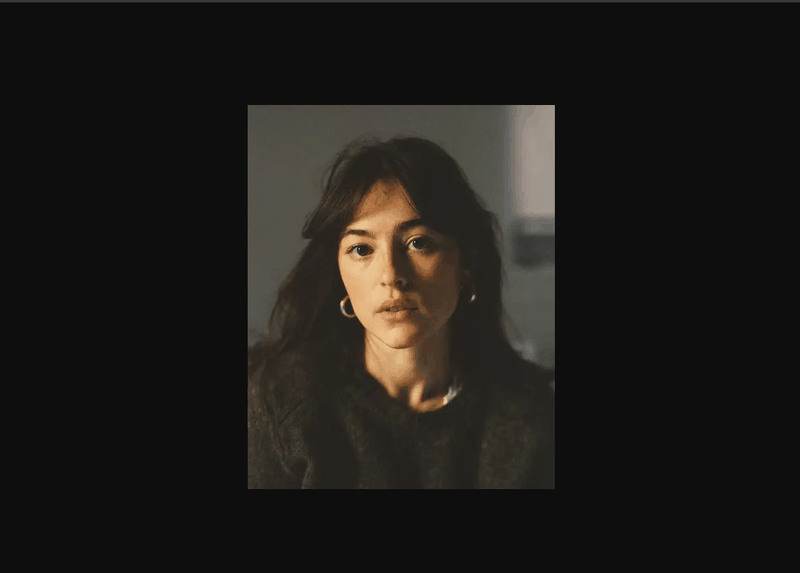

# pixl8it
Chrome extension that pixelates images. Right-click an image, pick **Pixelate**, and it opens in a new tab downscaled with a reduced color palette. Size and color count are adjustable.

Useful for references, palette studies and placeholder art. Never a replacement for hand-made pixel art. ♡

## Install
1. Open `chrome://extensions` and turn on **Developer mode**.
2. Click **Load unpacked** and pick this folder.
3. Right-click any image and choose **Pixelate**.

## Permissions
It asks for access to all sites because it needs to download the image you clicked. Cross-origin images can't be read from a canvas otherwise. `scripting` is only used for `blob:` images. 

## License
MIT
